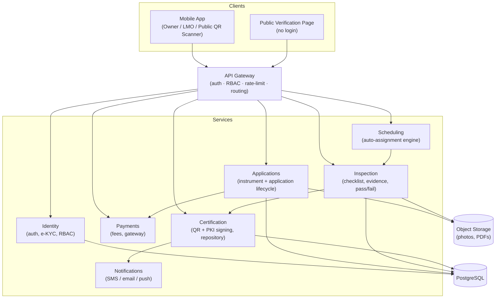
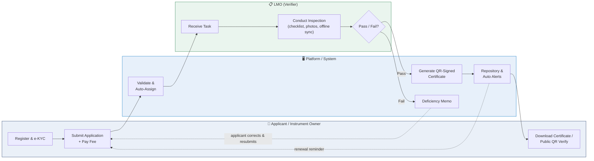
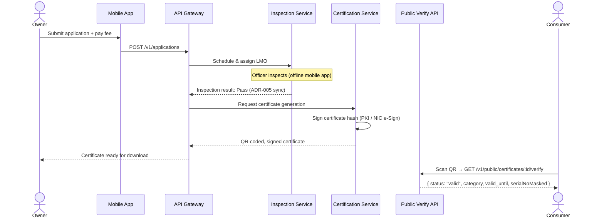

# eTulamaan

**Unified Online Verification & Digital Certification Platform for Weighing & Measuring Instruments**

SIH Problem Statement **26036** · Built under the Legal Metrology Act, 2009 & Legal Metrology (General) Rules, 2011

> Replaces India's manual, paper-based legal metrology verification process with one online, QR-certified, publicly auditable system — from application to inspection to public authentication.

---

## Table of Contents

- [The Problem](#the-problem)
- [What eTulamaan Does](#what-etulamaan-does)
- [System Architecture](#system-architecture)
- [End-to-End Workflow](#end-to-end-workflow)
- [Certificate Issuance & Verification](#certificate-issuance--verification)
- [Data Model](#data-model)
- [Tech Stack](#tech-stack)
- [Repository Structure](#repository-structure)
- [Getting Started](#getting-started)
- [Roles & Access](#roles--access)
- [Project Documentation](#project-documentation)
- [Contributing](#contributing)

---

## The Problem

Verification of weighing and measuring instruments today is manual and siloed: paper applications, disconnected local record-keeping, no way for a consumer or regulator to confirm a certificate is genuine, and no cross-jurisdiction visibility into what's overdue for re-verification. eTulamaan digitizes every step of this lifecycle into one national, auditable platform.

## What eTulamaan Does

- **Online registration** for instrument owners and LMOs with e-KYC (Aadhaar/DigiLocker)
- **Fully online applications** for verification and re-verification, including fee payment (Bharatkosh stub)
- **Rule-based scheduling** that assigns inspections to the right LMO officer
- **Offline-first mobile inspection app** for field officers — checklist, readings, geo-tagged photos, auto-syncs when connectivity returns per ADR-005
- **QR-coded, PKI-signed digital certificates**, generated automatically on a passed inspection
- **Public, no-login certificate verification** — anyone can scan a QR code and instantly see Valid / Expired / Revoked without owner PII
- **Automated validity tracking and renewal reminders** before a certificate expires
- **Multilingual i18n support** (English & Hindi) and dark mode compliance (`Design.md §1`)

## System Architecture

Microservices behind an API gateway, each service owning one bounded context of the verification lifecycle. Full rationale in [`Architecture.md`](Architecture.md).



## End-to-End Workflow

Cross-functional lifecycle across actors in the system. Full breakdown in [`PRD.md`](PRD.md).



## Certificate Issuance & Verification

What happens under the hood from a passed inspection to a consumer scanning the QR code.



## Tech Stack

| Layer | Technology |
|---|---|
| Mobile app | React Native (offline-first, Android priority) |
| Shared packages | TypeScript (`@etulamaan/shared-types`, `@etulamaan/ui-kit`) |
| Backend service | Node.js (Express) Mock API server (`@etulamaan/mock-api`), REST APIs |
| Database | PostgreSQL (transactional) |
| File storage | S3-compatible object storage (photos, PDFs) |
| Auth | OAuth2 / JWT, RBAC, 2FA for officers (ADR-004) |
| Certificate signing | PKI via licensed CA / NIC e-Sign |
| Payments | Government payment gateway (Bharatkosh / PayGov) |

## Repository Structure

```
/apps
  /mobile           # React Native field-inspection app (offline-first, Owner, LMO, Public)
/services
  /mock-api         # Backend API server matching Architecture.md contracts & ADR-005 sync
/packages
  /shared-types     # Cross-service TypeScript types / API contracts
  /ui-kit           # Shared design-system components & tokens
/infra              # IaC, Docker/Kubernetes manifests, CI config
```

## Getting Started

```bash
# Clone
git clone <repo-url> && cd eTulamaan

# Start Backend Mock API Service
npm --prefix services/mock-api start

# Run API & ADR-005 Integration Tests
npm --prefix services/mock-api test

# Start Mobile App (Expo / React Native)
npm --prefix apps/mobile start
```

See [`Agents.md`](Agents.md) for repo conventions and [`Test.md`](Test.md) for what the test suite covers.

## Roles & Access

| Role | Can do |
|---|---|
| **Owner** | Self-register + e-KYC, submit applications, pay fees, download certificates |
| **LMO** | Receive assigned inspections, conduct offline inspections, issue pass/fail, sync results |
| **Public / Consumer** | Scan QR code to verify a certificate — no login required, zero owner PII |

RBAC is enforced server-side on every request — see [`Rules.md`](Rules.md).

## Project Documentation

| Doc | Covers |
|---|---|
| [`PRD.md`](PRD.md) | Product requirements, personas, success metrics |
| [`Agents.md`](Agents.md) | How AI/dev agents should work in this repo |
| [`Design.md`](Design.md) | Brand palette, typography, UI patterns, key screens |
| [`Architecture.md`](Architecture.md) | Services, data model, API & security design |
| [`Rules.md`](Rules.md) | Coding, git, secrets, and review conventions |
| [`Memory.md`](Memory.md) | Domain glossary and durable project context |
| [`Decision.md`](Decision.md) | Architecture Decision Records (ADRs) |
| [`Test.md`](Test.md) | Testing strategy and required coverage |

---

<sub>Built for Smart India Hackathon — Problem Statement 26036.</sub>
