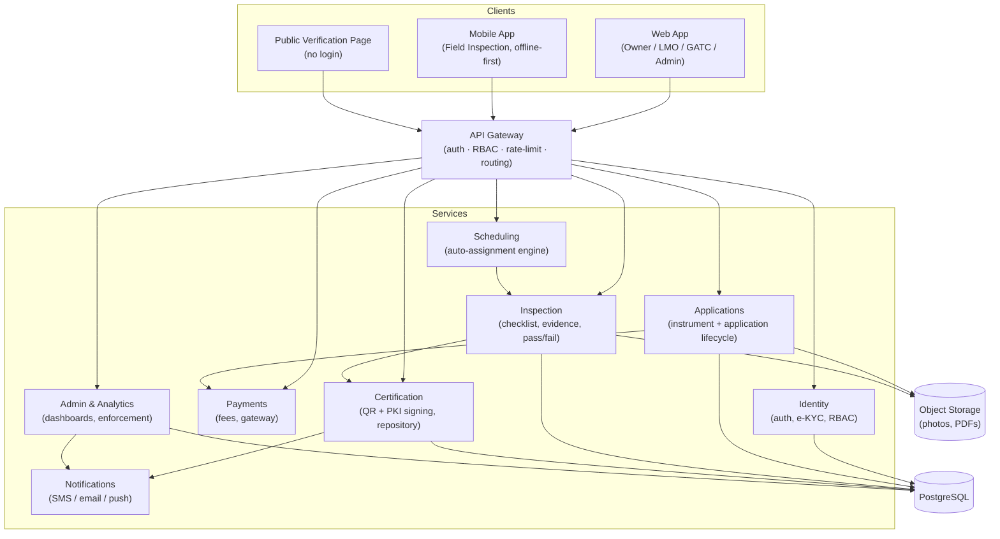
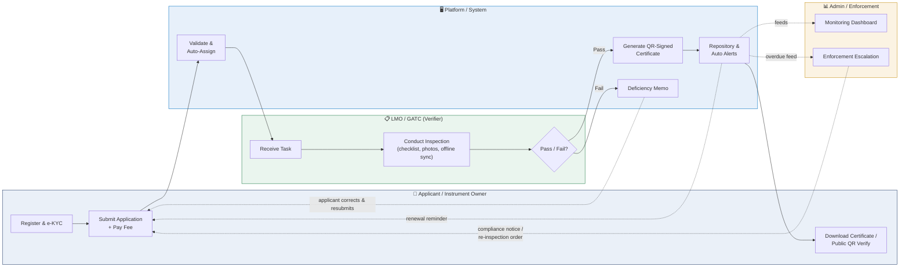
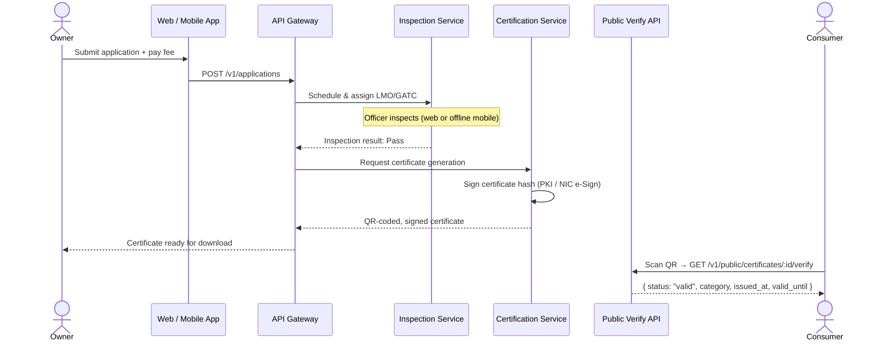
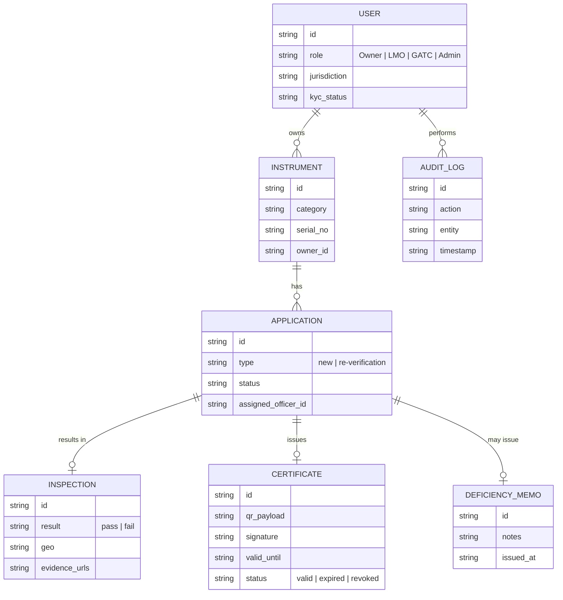

# eTulamaan

**Unified Online Verification & Digital Certification Platform for Weighing & Measuring Instruments**

SIH Problem Statement **26036** · Built under the Legal Metrology Act, 2009 & Legal Metrology (General) Rules, 2011

> Replaces India's manual, paper-based legal metrology verification process with one online, QR-certified, publicly auditable system — from application to inspection to public authentication.

---

## Table of Contents

- [The Problem](#the-problem)
- [What eTulamaan Does](#what-eTulamaan-does)
- [System Architecture](#system-architecture)
- [End-to-End Workflow](#end-to-end-workflow)
- [Certificate Issuance & Verification](#certificate-issuance--verification)
- [Data Model](#data-model)
- [Tech Stack](#tech-stack)
- [Repository Structure](#repository-structure)
- [Getting Started](#getting-started)
- [Roles & Access](#roles--access)
- [Project Documentation](#project-documentation)
- [Contributing](#contributing)

---

## The Problem

Verification of weighing and measuring instruments today is manual and siloed: paper applications, disconnected local record-keeping, no way for a consumer or regulator to confirm a certificate is genuine, and no cross-jurisdiction visibility into what's overdue for re-verification. eTulamaan digitizes every step of this lifecycle into one national, auditable platform.

## What eTulamaan Does

- **Online registration** for instrument owners, LMOs, and GATCs, with e-KYC (Aadhaar/DigiLocker)
- **Fully online applications** for verification and re-verification, including fee payment
- **Rule-based scheduling** that auto-assigns inspections to the right LMO/GATC
- **Offline-first mobile inspection app** for field officers — checklist, readings, geo-tagged photos, syncs when connectivity returns
- **QR-coded, PKI-signed digital certificates**, generated automatically on a passed inspection
- **Public, no-login certificate verification** — anyone can scan a QR code and instantly see Valid / Expired / Revoked
- **Automated validity tracking and renewal reminders** before a certificate expires
- **Admin dashboards** for pendency, SLA compliance, and enforcement across jurisdictions

## System Architecture

Microservices behind an API gateway, each service owning one bounded context of the verification lifecycle. Full rationale in [`docs/Architecture.md`](docs/Architecture.md).



## End-to-End Workflow

Cross-functional lifecycle across the four actors in the system. Solid arrows are the main process flow; dashed arrows are data feeds and notification loops. Full breakdown in [`docs/PRD.md`](docs/PRD.md).



## Certificate Issuance & Verification

What happens under the hood from a passed inspection to a consumer scanning the QR code.



## Data Model

Core entities — see [`docs/Architecture.md`](docs/Architecture.md) for the full field list and constraints (`AuditLog` and `Certificate` are append-only).



## Tech Stack

| Layer | Technology |
|---|---|
| Web frontend | React / Next.js, Tailwind CSS |
| Mobile app | React Native (offline-first, Android priority) |
| Backend | Node.js (Express) / Spring Boot, REST APIs |
| Database | PostgreSQL (transactional) |
| File storage | S3-compatible object storage (photos, PDFs) |
| Auth | OAuth2 / JWT, RBAC, 2FA for officers/admins |
| Certificate signing | PKI via licensed CA / NIC e-Sign |
| Notifications | SMS / email / push (Firebase Cloud Messaging) |
| Payments | Government payment gateway (Bharatkosh / PayGov) |
| Deployment | Docker, Kubernetes, NIC / MeghRaj government cloud |

Full stack rationale: [`docs/Architecture.md`](docs/Architecture.md).

## Repository Structure

```
/apps
  /web              # React/Next.js dashboards (Owner, LMO/GATC, Admin)
  /mobile           # React Native field-inspection app (offline-first)
/services
  /identity         # registration, e-KYC, auth, RBAC
  /applications     # instrument + application lifecycle
  /scheduling       # assignment engine
  /inspection       # checklist, evidence, pass/fail
  /certification    # QR + PKI signing, certificate repository
  /notifications    # SMS/email/push alerts
  /payments         # fee collection, gateway integration
  /admin-analytics  # dashboards, reports, enforcement
/packages
  /shared-types     # cross-service TypeScript types / API contracts
  /ui-kit           # shared design-system components
/infra              # IaC, Docker/Kubernetes manifests, CI config
/docs               # PRD, architecture, design, rules, decisions, tests
```

## Getting Started

```bash
# Clone
git clone <repo-url> && cd eTulamaan

# Backend service (example — repeat per service)
cd services/<service-name> && npm install && npm run dev

# Web app
cd apps/web && npm install && npm run dev

# Mobile app
cd apps/mobile && npm install && npx expo start

# Full test suite
npm run test
```

See [`docs/Agents.md`](docs/Agents.md) for repo conventions and [`docs/Test.md`](docs/Test.md) for what the test suite actually covers.

## Roles & Access

| Role | Can do |
|---|---|
| **Owner** | Register instruments, submit applications, pay fees, download certificates |
| **LMO** | Receive assigned inspections, conduct inspections (web/mobile), issue pass/fail |
| **GATC** | Same as LMO, for third-party-authorized centres |
| **Admin** | Monitor dashboards, manage users/master data, handle enforcement |
| **Public / Consumer** | Scan QR to verify a certificate — no login required |

RBAC is enforced server-side on every request, not just hidden in the UI — see [`docs/Rules.md`](docs/Rules.md).

## Project Documentation

| Doc | Covers |
|---|---|
| [`docs/PRD.md`](docs/PRD.md) | Product requirements, personas, success metrics |
| [`docs/Agents.md`](docs/Agents.md) | How AI/dev agents should work in this repo |
| [`docs/Design.md`](docs/Design.md) | Brand, typography, UI patterns, key screens |
| [`docs/Architecture.md`](docs/Architecture.md) | Services, data model, API & security design |
| [`docs/Rules.md`](docs/Rules.md) | Coding, git, secrets, and review conventions |
| [`docs/Memory.md`](docs/Memory.md) | Domain glossary and durable project context |
| [`docs/Decision.md`](docs/Decision.md) | Architecture Decision Records (ADRs) |
| [`docs/Test.md`](docs/Test.md) | Testing strategy and required coverage |

## Contributing

Read [`docs/Agents.md`](docs/Agents.md) and [`docs/Rules.md`](docs/Rules.md) before opening a PR. In short: one concern per PR, Conventional Commits, tests required per [`docs/Test.md`](docs/Test.md), and any architectural change needs an ADR in [`docs/Decision.md`](docs/Decision.md).

---

<sub>Built for Smart India Hackathon — Problem Statement 26036.</sub>
