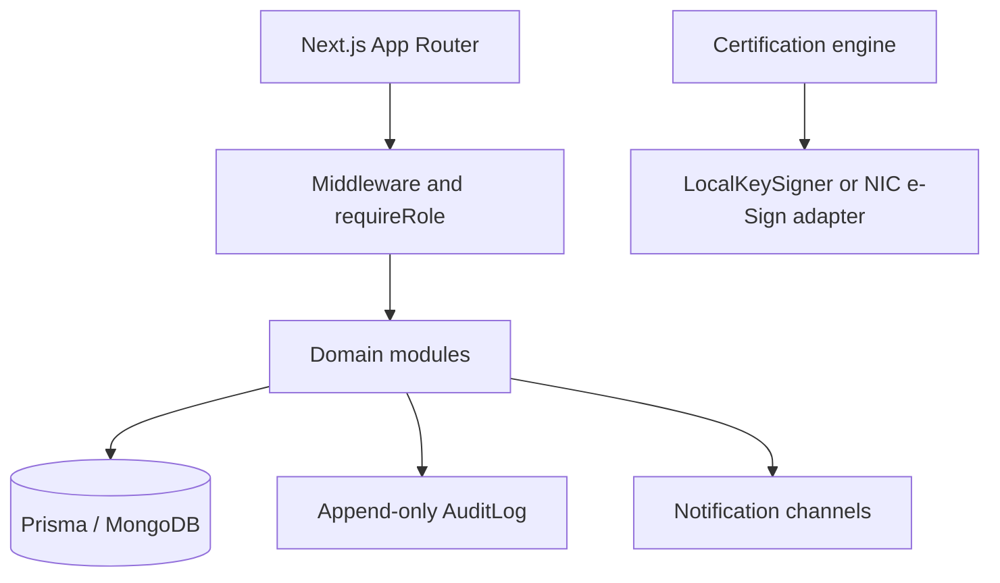
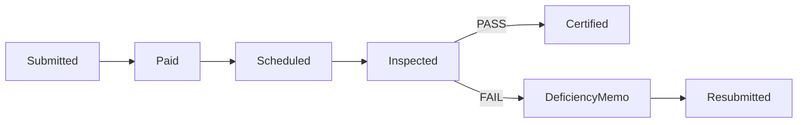
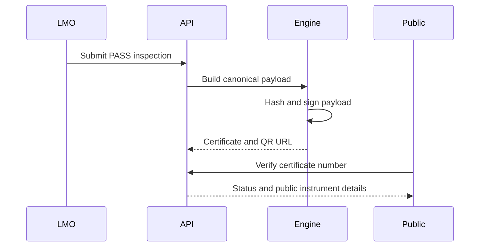

# Architecture

The application is a modular monolith. Each domain owns its schemas, service logic, and route handlers; Prisma is the persistence boundary.

```mermaid
graph TD
  UI[Next.js App Router] --> Guard[Middleware and requireRole]
  Guard --> Modules[Domain modules]
  Modules --> Prisma[(Prisma / MongoDB)]
  Modules --> Audit[Append-only AuditLog]
  Modules --> Notify[Notification channels]
  Certification[Certification engine] --> Signer[LocalKeySigner or NIC e-Sign adapter]
```

```mermaid
flowchart LR
  Submitted --> Paid --> Scheduled --> Inspected
  Inspected -->|PASS| Certified
  Inspected -->|FAIL| DeficiencyMemo --> Resubmitted
```

```mermaid
sequenceDiagram
  participant LMO
  participant API
  participant Engine
  participant Public
  LMO->>API: Submit PASS inspection
  API->>Engine: Build canonical payload
  Engine->>Engine: Hash and sign payload
  Engine-->>API: Certificate and QR URL
  Public->>API: Verify certificate number
  API-->>Public: Status and public instrument details
```
